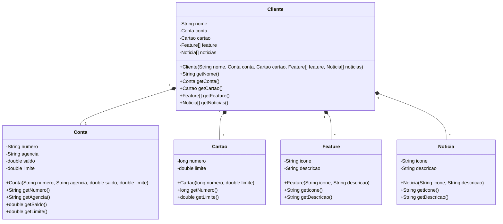

# Projeto-dio-api | Santander
Projeto API Restful

## Diagrama de Classes

```mermaid
classDiagram
    class Cliente {
        -String nome
        -Conta conta
        -Cartao cartao
        -Feature[] feature
        -Noticia[] noticias
        +Cliente(String nome, Conta conta, Cartao cartao, Feature[] feature, Noticia[] noticias)
        +String getNome()
        +Conta getConta()
        +Cartao getCartao()
        +Feature[] getFeature()
        +Noticia[] getNoticias()
    }

    class Conta {
        -String numero
        -String agencia
        -double saldo
        -double limite
        +Conta(String numero, String agencia, double saldo, double limite)
        +String getNumero()
        +String getAgencia()
        +double getSaldo()
        +double getLimite()
    }

    class Cartao {
        -long numero
        -double limite
        +Cartao(long numero, double limite)
        +long getNumero()
        +double getLimite()
    }

    class Feature {
        -String icone
        -String descricao
        +Feature(String icone, String descricao)
        +String getIcone()
        +String getDescricao()
    }

    class Noticia {
        -String icone
        -String descricao
        +Noticia(String icone, String descricao)
        +String getIcone()
        +String getDescricao()
    }

    Cliente "1" *-- "1" Conta
    Cliente "1" *-- "1" Cartao
    Cliente "1" *-- "*" Feature
    Cliente "1" *-- "*" Noticia

```
